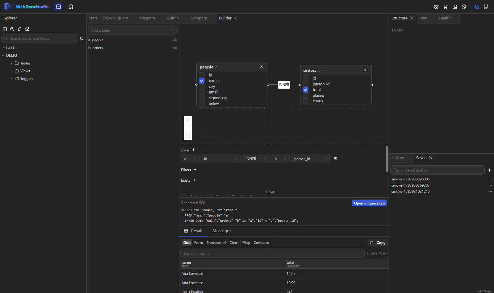

# Query-Builder

Der Builder ist für die Abfragen, die man sonst schreibt, indem man nachsieht, welche Spalte auf
welche zeigt. Er erzeugt gewöhnliches SQL und gibt es an einen Abfrage-Tab — nichts, was er baut,
braucht ihn zum Ausführen.



## Die Arbeitsfläche

Eine Tabelle aus dem Feld links landet als Karte auf der Fläche. Jede Spalte der Karte hat eine
Checkbox; ein Häkchen setzt sie ins `SELECT`.

Vom Anfasser einer Karte zu einer anderen ziehen ergibt einen Join. Kennt das Schema die Beziehung
schon — ein Fremdschlüssel in einer der beiden Richtungen —, ist die Bedingung bereits ausgefüllt:
`orders` und `people` verbinden sich über `orders.person_id = people.id`, ohne dass es jemand tippt.
Wo es keinen Schlüssel gibt, ist die erste Spalte beider Seiten ein Ausgangspunkt, den du in der
Join-Zeile unter der Fläche korrigierst.

- Doppelklick auf eine Join-Linie entfernt sie.
- Das × auf einer Karte entfernt Tabelle, Joins, gewählte Spalten und Filter.
- Joins, Filter und Sortierung sind unter der Fläche auch als exakte Zeilen editierbar — eine Linie
  kann ausdrücken, dass zwei Tabellen verbunden sind, nicht dass die Bedingung `>=` lautet.

## Während du baust

Unter der Fläche steht das erzeugte SQL und darunter dessen erste 50 Zeilen, 400 ms nachdem du
aufhörst zu ändern erneut ausgeführt. Eine Abfrage, die noch nicht läuft, zeigt dort ihren Fehler,
und nichts hört auf zu funktionieren.

Filterwerte werden zu Bind-Parametern, nie zu String-Literalen — der Builder lässt sich nicht dazu
bringen, eine Injection für dich zu schreiben.

## Aggregate

Gibt eine gewählte Spalte ein Aggregat (`count`, `sum`, `avg`, `min`, `max`), wird die Abfrage
gruppiert: jede Spalte ohne Aggregat wandert automatisch ins `GROUP BY`, weil jede Engine das
verlangt. Ein Abschnitt **Having** erscheint, sobald etwas aggregiert, und seine Bedingungen gelten
für das Aggregat statt für die Spalte. `Distinct` und `Limit` stehen neben dem Gruppierungsschalter.

## EXISTS und NOT EXISTS

Der Abschnitt **Exists** fügt eine Bedingung über eine Tabelle hinzu, die *nicht* Teil der Abfrage
ist: Tabelle wählen, die Spalte auf ihrer Seite, und die Spalte der Abfrage, zu der sie passt.

`NOT EXISTS` ist der Grund, warum es das überhaupt gibt. „Kunden ohne Bestellungen" lässt sich nicht
als Join schreiben: ein Join, der nichts findet, entfernt die Zeile, statt sie zu behalten, und
`LEFT JOIN … IS NULL` ist der Umweg, den jeder nachschlagen muss. Jede Unterabfrage bekommt einen
eigenen Alias (`x1`, `x2`) und kann deshalb nicht mit den Tabellen der Abfrage kollidieren.

## Die Abfrage zurückholen

„Open in query tab" hängt das Modell des Builders als Kommentar an das Statement:

```sql
SELECT "a"."name", SUM("b"."total") AS "spent"
  FROM "main"."people" "a"
  INNER JOIN "main"."orders" "b" ON "a"."id" = "b"."person_id"
 GROUP BY "a"."name";
/* wds:model {"tables":[…],"joins":[…]} */
```

Dieser Kommentar ist es, der **Open this query in the builder** (Befehlspalette) die Abfrage wieder
auf eine Fläche legen lässt. Filterwerte bleiben absichtlich draußen: der Kommentar reist mit dem SQL
in den Verlauf und in alles, wo man es einfügt.

Ein handgeschriebenes Statement trägt keinen solchen Kommentar, und der Builder tut nicht so, als
verstünde er es — es steckt kein SQL-Parser dahinter, und ein halb funktionierender wäre schlimmer
als die ehrliche Grenze.

## OData-Dienste

Eine OData-Verbindung hat ihren eigenen Baukasten, weil es kein SQL zu erzeugen gibt: eine Anfrage
ist ein Ressourcenpfad mit Query-Optionen, und die Form schreibt genau die. Der Zauberstab öffnet
sie im Abfrage-Tab und im Daten-Tab — dieselbe Form über demselben Dienst, die im einen eine
Anfrage füttert und im anderen das Gitter.

Was sie anbietet, kommt aus dem `$metadata` des Dienstes, die Listen zeigen also, was existiert,
und nicht, was richtig getippt wurde:

- **Fields** ist `$select`. Nichts ausgewählt heißt alles, was die Entität hat.
- **Expand** ist `$expand` und bietet die Navigation Properties der Entität an — die Relationen.
  Eine expandierte Relation kommt als eine Spalte mit dem JSON, das der Dienst geschickt hat; der
  Viewer des Gitters öffnet es als Baum.
- **Filter** ist `$filter`, eine Zeile pro Bedingung: eine Property, ein Vergleich oder eines von
  `contains`, `startswith` und `endswith`, und ein Wert. Ob der Wert in Anführungszeichen steht,
  folgt dem Typ der Property: `20` auf einer Zahl ist `20`, auf einer Zeichenkette `'20'`. Zwei
  oder mehr Zeilen werden mit einem `and` oder einem `or` verbunden.
- **Order** ist `$orderby`, eine Zeile pro Property, aufsteigend oder absteigend.
- **Top** und **Skip** gibt es nur im Abfrage-Tab: im Daten-Tab blättert das Gitter.

Im Abfrage-Tab bleibt der Text im Editor die eine Wahrheit. Die Form wird daraus gelesen und dorthin
zurückgeschrieben, Tippen und Klicken sind also dieselbe Geste auf zwei Weisen, und die Anfrage
unter der Form ist die, die rausgeht.

Ein `$filter`, den die Form nicht zerlegen kann — etwa `(A eq 1 or B eq 2) and C eq 3` — bleibt
genau so stehen, wie er getippt wurde, in einem Feld, das das sagt. Auf dem Weg durch den Baukasten
geht nichts verloren, und **Build it instead** räumt ihn weg, wenn die Zeilen zurück sollen.
Optionen, für die die Form kein Feld hat, etwa `$apply`, reisen unverändert mit und sagen, dass sie
behalten werden.

Im Daten-Tab halten Form und Gitter beides: die eigene Sortierung einer Spalte oder ihr Filter
gewinnt gegen dieselbe Option in der Form, und ein im Spaltenkopf getippter Filter wird mit `and` an
den der Form angehängt.
